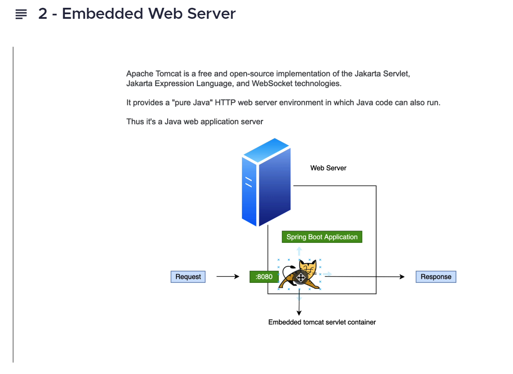
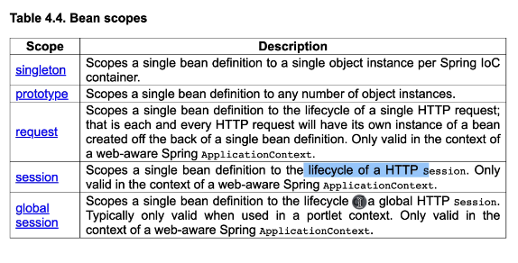

# Rest-Api-Using-SpringBoot3
I am building a Rest API using SpringBoot3, testing it, securing it, connecting it to a real database and deploying it to the cloud.

# Tools
Maven > install maven > verify installation mvn -v 
SpringBoot3
JDK > Java Development Kit 17^
Jackson > is a library for parsing Java object to Json Object, Json serialization and deserialization
https://github.com/FasterXML/jackson 
JSON Viewer > to view json as pretty in the web browser
intellij Rest client plugin > RestfulTool
Docker

MongoDB
<dependency>
<groupId>org.springframework.data</groupId>
<artifactId>spring-data-mongodb</artifactId>
<version>4.1.0</version>
</dependency>

public apis > https://github.com/public-apis/public-apis
stripe payment api > https://stripe.com/docs/api

# Java Embedded Web Servers
Java Embedded Web Servers are lightweight web servers that can be embedded in a Java application.
These servers provide a convenient way to develop, test,
and deploy web applications without the need for a separate web server installation.
In this context, Tomcat, Jetty, and Undertow are popular Java Embedded Web Servers.

Apache Tomcat is an open-source web server that is widely used for Java web application development.
Tomcat supports servlets and JavaServer Pages (JSPs), and it provides a simple and lightweight HTTP server.
Tomcat is easy to set up and configure, and it supports a range of advanced features such as SSL,
virtual hosting, and clustering.

Jetty is another popular open-source web server and servlet container for Java applications.
Jetty is designed to be lightweight and fast, and it provides a modular architecture that
allows users to customize the server as per their requirements.
Jetty supports WebSocket, SPDY, and HTTP/2 protocols and is commonly used in embedded applications,
such as IoT devices and mobile applications.

Undertow is a relatively new web server designed to be lightweight and flexible.
It is also a component of the popular WildFly application server.
Undertow supports both blocking and non-blocking I/O, and it provides
an embedded Servlet container for web application deployment.
Undertow is easy to configure and provides excellent performance even for high-traffic websites.

In summary, Tomcat, Jetty, and Undertow are all popular Java Embedded Web Servers that provide lightweight
and easy-to-use HTTP server capabilities for web application development.
Each server has its own strengths and features, making them suitable
for different use cases and application requirements.

# Spring Annotation
@ComponentScan
Is responsible for telling Spring where to look for components.
This annotation is part of @SpringBootApplication which can be found 
on the main class of any Spring Boot application.
By default, Spring will search within the package that the main class is located,
along with all of its child packages.
As such, it is very important to only put components in the same package
or a child package:

@Component
This annotation is a class level annotation, and it tells spring that this class is a component 
so that the spring IOC/DI container can register a bean for the class and managed the bean.
In addition to the @Component annotation, you can also use
@Repository, @Service, and @Controller annotations.
Each of these annotations has a specific purpose and spring will manage your components
accordingly.
For example, the @Repository annotation is used for classes that implement
data access objects (DAOs).
The spring container will manage these classes and ensure that they have all
the necessary dependencies injected.
Similarly, the @Service annotation is used for classes that provide business logic services.
Spring will manage these classes and ensure that they have all the necessary dependencies injected.

@Bean
This is a method level annotation that is used to explicitly declare a bean definition
in a configuration class annotated with @Configuration or @Import
It is typically used when you want more fine-grained control over the configuration of the bean.
Overall, @Bean is used to declare a method that provides an instance of a bean to the Spring container,
where we have more control over the configuration of the bean, compared to just using the @component annotation.
In Spring, @Bean is an annotation that is used to declare a single bean.
It is generally used to configure third-party beans
or beans that are not defined in the application context.

@Configuration
This annotation is used to denote a class that has a method annotated with @Bean. 
The annotation register a bean of type AnnotationConfigApplicationContext to the spring container.
That bean can be used to configure a Bean returned by a method annotated with @Bean.

@EnableAutoConfiguration

@Autowired

@Qualifier

@PropertySource

# Spring MVC annotation
The Spring Web MVC (model-view-controller) framework provides
a very easy way of implementing MVC architecture in our web applications.
The Java language has a low level API called the Servlets API,
which allows us to write servlets which are special Java classes for handling
HTTP request/responses. However, working directly with the servlets API can be clunky when working on large,
enterprise grade applications. We need a better way...
Spring MVC abstracts away a lot of the messy details you would have to understand
and manage yourself if writing servlets manually.
It exposes a custom set of annotations which we apply to our classes
and methods to assign their responsibility within the MVC architecture.
By using annotations to mark the responsibilities of our classes, Spring Web MVC cuts out a lot of boilerplate.
Creating Restful services becomes very easy.
The following are the most important annotations we need to know when working with Spring MVC.

@Controller
marks the class as a web controller. A specialisation of the @component annotation, which allows Spring to auto-detect implementation classes/beans by scanning the classpath.

@RestController
The @RestController annotation is a convenience syntax for @Controller and @ResponseBody together. This indicates that the class is a controller, and that all the methods in the marked class will return a JSON response.

@ResponseBody
The @ResponseBody is a utility annotation that tells Spring to automatically serialize return value(s) of this classes methods into HTTP responses. When building a JSON endpoint, this is an amazing way to "magically" convert your objects into JSON for easier consumption. If we use the @RestController annotation on our class, we don't need this annotation at all, because @RestController inherits from it.

@RequestBody
The @RequestBody annotation is used to bind the HTTP request body to a Java object. The @RequestBody annotation is part of the spring framework and is used in conjunction with the spring MVC web framework. The spring MVC web framework is a Java-based web application framework that provides a comprehensive set of features for building web applications. The spring framework is a popular choice for building Java-based web applications. The spring MVC web framework is based on the Model-View-Controller (MVC) architecture. The MVC architecture is a design pattern that separates an application into three components: the model, the view, and the controller. The @RequestBody annotation is used to bind the HTTP request body to the controller. The controller processes the request and then sends the response back to the view. The view displays the response to the user.

@RequestMapping(method = RequestMethod.GET, value = "/path")
The @RequestMapping(method = RequestMethod.GET, value = "/path") annotation specifies a method in the controller that should be responsible for serving the HTTP request to the given path, or endpoint. Spring handles the mechanical details of how this is achieved for you. You simply specify the method and path parameters on the annotation and Spring will route the requests into the correct action methods. If you don't specify a method value, it will default to GET.

@GetMapping(value = "/path")
An abbreviated form of @RequestMapping specifically for HTTP GET requests, which only takes an optional value argument, no method argument. The read in CRUD.

@PostMapping(value = "/path")
An abbreviated form of @RequestMapping specifically for HTTP POST requests, which only takes an optional value argument, no method argument. The create in CRUD.

@PutMapping(value = "/path")
An abbreviated form of @RequestMapping specifically for HTTP PUT requests, which only takes an optional value argument, no method argument. The update in CRUD.

@DeleteMapping(value = "/path")
An abbreviated form of @RequestMapping specifically for HTTP DELETE requests, which only takes an optional value argument, no method argument. The delete in CRUD.

@RequestParam(value="name", defaultValue="World")
Naturally, the methods handling the requests might take parameters.
To help you with binding the HTTP parameters into the action method arguments,
you can use the @RequestParam(value="name", defaultValue="World") annotation.
Spring will parse the request parameters and put the appropriate ones into your method arguments.

@PathVariable("placeholderName")
Another common way to provide information to the backend is to encode it in the URL. Then you can use the @PathVariable("placeholderName") annotation to bring the values from the URL to the method arguments.

# Bean scopes

#Steps
create a maven/springboot3 project with spring initializr

# Continuous Deployment
mvn compile >

unit tests >
Maven Surefire Plugin: https://maven.apache.org/surefire/maven-surefire-plugin/
The Surefire plugin should execute on the unit tests, not the integration tests.
It needs to be configured so that only the unit tests are executed.
The surefire plugin is configured to execute any class that ends with Tests.

integration tests >
Maven Failure Plugin: https://maven.apache.org/surefire/maven-failsafe-plugin/
The maven failsafe plugin is used to execute the integration tests

Generate a Jar file > 
spring boot maven plugin: https://docs.spring.io/spring-boot/docs/current/maven-plugin/reference/htmlsingle/
./mvnw clean | mvn clean    > delete the target folder
mvn package                 > create a jar
java -jar target/Rest-Api-Using-SpringBoot3-0.0.1-SNAPSHOT.jar > run the jar

Packaging the jar file into a docker image with Jib >
https://github.com/GoogleContainerTools/jib

pushing the image to a docker registry (dockerHub|gitHub packages - ghcr|AWS ECR| Google GCR) >
mvn clean package

# pulling an image from docker hub:
docker pull thiernohgradiagram/rest-api-using-springboot3:0.0.1-SNAPSHOT
docker pull thiernohgradiagram/rest-api-using-springboot3:latest

# running the container 
docker run --name thiernohsRestApi --rm -p 8080:8080

docker ps	List running containers
docker ps -a	List all containers (including stopped ones)
docker images	List images
docker run <image>	Run a container from an image
docker stop <container>	Stop a running container
docker rm <container>	Remove a stopped container
docker rmi <image>	Remove an image
docker build <path/to/dockerfile>	Build an image from a Dockerfile
docker tag <image> <new_name:tag>	Tag an image with a new name and optional tag
docker login	Log in to a Docker registry
docker push <image>	Push an image to a Docker registry
docker pull <image>	Pull an image from a Docker registry
docker exec -it <container> <command>	Execute a command in a running container
docker-compose up	Start all services defined in a docker-compose.yml file
docker-compose down	Stop all services defined in a docker-compose.yml file

deploy the image to a docker registry of your choice as a public or private image.

run the image as a container on AWS ECS > Elastic Container Service Or Kubernetes.

// protecting mongoDB credentials
// https://frugalisminds.com/how-to-encrypt-passwords-in-spring-boot-configuration/

